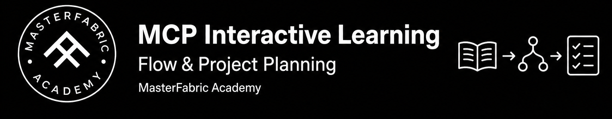
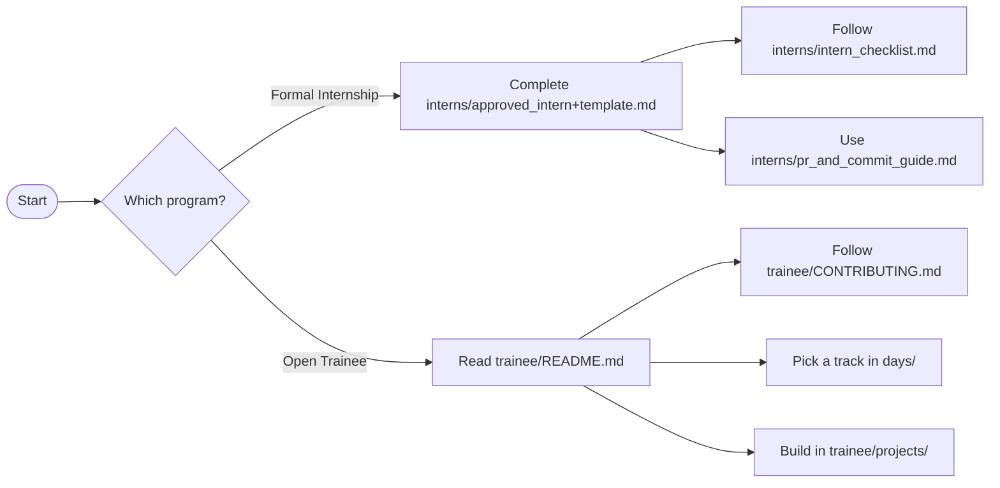

# 🚀 MasterFabric 100-Day Software Developer Roadmap

[](https://github.com/masterfabric/one-hundered-days)


MasterFabric Information Technology Inc. builds exceptional software solutions—mobile apps, backend services, full‑stack web apps, and AI-powered systems. This repository contains a structured learning + delivery roadmap designed to take developers from **foundational skills** to **professional competence**.

## Tracks (quick view)

Quick overview of the available tracks. Open a roadmap for the full curriculum and day-by-day plan.

| Track | Duration | Focus | Roadmap |
|---|---:|---|---|
| Flutter | 100 days |   | [`/days/flutter/flutter_roadmap.md`](./days/flutter/flutter_roadmap.md) |
| Expo / React Native | 100 days |   | [`/days/expo/expo_roadmap.md`](./days/expo/expo_roadmap.md) |
| DevOps | 100 days |  | [`/days/devops/devops_roadmap.md`](./days/devops/devops_roadmap.md) |
| NestJS | 100 days |   | [`/days/nestjs/nestjs_roadmap.md`](./days/nestjs/nestjs_roadmap.md) |
| Next.js | 100 days |   | [`/days/nextjs/nextjs_roadmap.md`](./days/nextjs/nextjs_roadmap.md) |
| Go | 100 days |  | [`/days/go/go_roadmap.md`](./days/go/go_roadmap.md) |
| TypeScript | 100 days |  | [`/days/typescript/typescript_roadmap.md`](./days/typescript/typescript_roadmap.md) |
| GraphQL | 100 days |  | [`/days/graphql/graphql_roadmap.md`](./days/graphql/graphql_roadmap.md) |
| OOP | 20 days |  | [`/days/oop/oop_roadmap.md`](./days/oop/oop_roadmap.md) |
| SDLC | 16 days |  | [`/days/sdlc/sdlc_roadmap.md`](./days/sdlc/sdlc_roadmap.md) |
| Git | 16 days |  | [`/days/git/git_roadmap.md`](./days/git/git_roadmap.md) |
| AI Agents | 100 days |  | [`/days/ai-agents/ai-agents_roadmap.md`](./days/ai-agents/ai-agents_roadmap.md) |

### Track covers

<p align="center">
  <a href="./days/flutter/flutter_roadmap.md"></a>
  <a href="./days/expo/expo_roadmap.md"></a>
  <a href="./days/devops/devops_roadmap.md"></a>
</p>
<p align="center">
  <a href="./days/nestjs/nestjs_roadmap.md"></a>
  <a href="./days/nextjs/nextjs_roadmap.md"></a>
  <a href="./days/go/go_roadmap.md"></a>
</p>
<p align="center">
  <a href="./days/typescript/typescript_roadmap.md"></a>
  <a href="./days/graphql/graphql_roadmap.md"></a>
  <a href="./days/ai-agents/ai-agents_roadmap.md"></a>
</p>
<p align="center">
  <a href="./days/git/git_roadmap.md"></a>
</p>

## Quick navigation

- **Start here**
  - **Formal Internship onboarding**: [`/interns/approved_intern+template.md`](./interns/approved_intern+template.md)
  - **Open Trainee program (Academy)**: [`/trainee/README.md`](./trainee/README.md)
- **Templates & rules**
  - PR/commit guide: [`/interns/pr_and_commit_guide.md`](./interns/pr_and_commit_guide.md)
  - Intern checklist: [`/interns/intern_checklist.md`](./interns/intern_checklist.md)
  - Trainee contributing: [`/trainee/CONTRIBUTING.md`](./trainee/CONTRIBUTING.md)
  - Learning paths index: [`/trainee/LEARNING_PATHS.md`](./trainee/LEARNING_PATHS.md)
- **Projects**
  - Trainee projects root: [`/trainee/projects/`](./trainee/projects/)
  - Example Next.js project: **FinderDev** → [`/trainee/projects/finder_dev/`](./trainee/projects/finder_dev/)
- **MCP (interactive learning)**
  - Academy MCP: [`/mcp/README.md`](./mcp/README.md)
  - English chat examples: [`/mcp/EXAMPLES.md`](./mcp/EXAMPLES.md)

---

<p align="center">
  <a href="./mcp/README.md">
    
  </a>
  <br /><br />
  <strong>MCP Interactive Learning</strong><br />
  Flow &amp; Project Planning
</p>

<p align="center">
  <a href="./mcp/README.md">
    
  </a>
</p>

> [!IMPORTANT]
> **MCP interactive learning & project planning**  
> Prefer the [`masterfabric-academy`](./mcp/README.md) MCP for day-by-day guidance and delivery planning. Do not improvise a parallel syllabus — teach from official `days/` lessons, keep the mentor persona stack, and plan projects against roadmap phases.  
> Quick start: [mcp/EXAMPLES.md](./mcp/EXAMPLES.md) · Setup: [mcp/README.md](./mcp/README.md)

### Prompt the MCP — Interactive learning flow

Paste into Cursor (with MCP enabled):

```text
Use masterfabric-academy MCP.
Call start_learning_session with track=go, day=1,
learner_goal="Interactive learning with instructor persona".
Teach Today's Tasks only from the returned day lesson.
```

| Step | What to ask the agent | Tool |
| ---: | --- | --- |
| 1 | Start my track from Day 1 | `start_learning_session` |
| 2 | Stay on today's official tasks | `get_day_lesson` |
| 3 | Close the day and plan tomorrow | `guide_next_steps` |

More copy-paste chats → **[mcp/EXAMPLES.md](./mcp/EXAMPLES.md)**

### Prompt the MCP — Project planning

Use the same mentor stack to turn a phase into a small delivery plan:

```text
Use masterfabric-academy MCP.
1) get_roadmap track=go parsed=true
2) I am on day 31 — plan a 5-day MVP project aligned to that phase
3) Keep security + high-traffic habits in the plan
4) End with guide_next_steps for my current day
```

| Focus | Prompt cue | Docs |
| --- | --- | --- |
| Phase goals | “Show phases, then plan this block” | [Go roadmap](./days/go/go_roadmap.md) |
| Capstone / demo | “Hardening + delivery checklist” | [EXAMPLES → C](./mcp/EXAMPLES.md#c--roadmap--phase-planning) |
| Trainee build | “Map days to a project in trainee/projects” | [trainee/projects](./trainee/projects/) |

### Prompt the MCP — Mentor personas

```text
Use masterfabric-academy MCP.
Load get_mentor_persona persona=all, then get_academy_skill.
Teach me as lead instructor + staff engineer for secure, high-traffic code.
```

| Persona | Use when |
| --- | --- |
| `lead-instructor` | Day-by-day teaching |
| `staff-engineer` | Architecture & production quality |
| `security-coach` | Auth, input validation, safe defaults |
| `delivery-manager` | Cadence, DoD, phase milestones |

Full persona + skill walkthrough → **[EXAMPLES → D](./mcp/EXAMPLES.md#d--load-personas--skill-then-teach)**

---

## Program core objectives

- **Track proficiency**: build strong competency in one track (mobile, backend, full-stack, or AI agents)
- **Architectural mastery**: Clean Code, Design Patterns, and professional application architecture
- **Quality assurance**: practical testing habits (**unit**, **widget/component**, **E2E**)
- **Professional workflow**: API design/integration, performance basics, and intro **CI/CD**

## Our commitment: the MasterFabric Manifesto

This program is guided by our core values.

- Read and acknowledge: `https://manifesto.masterfabric.co`

## Repository map (folders)

- [`/interns/`](./interns/): Formal internship resources, onboarding templates, and workflow standards
- [`/trainee/`](./trainee/): Open Trainee program (MasterFabric Academy) guides and projects
- [`/days/`](./days/): Track roadmaps (Flutter, Expo, DevOps, NestJS, Next.js, Go, TypeScript, GraphQL, OOP, SDLC, Git, AI Agents)
- [`/mcp/`](./mcp/): MasterFabric Academy MCP — interactive learning flow, mentor personas, and project planning

## Diagrams (Mermaid)

### Repository map

```mermaid
flowchart TB
  R[Repository Root] --> I[interns/]
  R --> T[trainee/]
  R --> D[days/]
  R --> M[mcp/]

  I --> I1[approved_intern+template.md]
  I --> I2[intern_checklist.md]
  I --> I3[pr_and_commit_guide.md]

  T --> T1[README.md]
  T --> T2[CONTRIBUTING.md]
  T --> T3[LEARNING_PATHS.md]
  T --> TP[projects/]
  TP --> FD[finder_dev/]

  M --> M1[README.md + EXAMPLES.md]
  M --> M2[mentor personas + day skill]

  D --> F[flutter/flutter_roadmap.md]
  D --> E[expo/expo_roadmap.md]
  D --> V[devops/devops_roadmap.md]
  D --> N[nestjs/nestjs_roadmap.md]
  D --> NX[nextjs/nextjs_roadmap.md]
  D --> GO[go/go_roadmap.md]
  D --> TS[typescript/typescript_roadmap.md]
  D --> GQL[graphql/graphql_roadmap.md]
  D --> OOP[oop/oop_roadmap.md]
  D --> SDLC[sdlc/sdlc_roadmap.md]
  D --> G[git/git_roadmap.md]
  D --> A[ai-agents/ai-agents_roadmap.md]
```



### Onboarding decision flow



## Programs & onboarding

This repository serves **two distinct programs**. Follow the instructions for your program.

### Formal internship program

Formal internship onboarding is managed through our internal platform:

- Onboarding platform: `https://welcome.masterfabric.co`

Upon approval, IT will create your corporate email (`internship.yourname@masterfabric.co`). Use the internal platform to connect with colleagues and complete onboarding.

### Open trainee program (MasterFabric Academy)

As a trainee in our open, non-profit program, your journey starts here:

- Getting started: [`/trainee/README.md`](./trainee/README.md)

## The 100-day pledge

Success is measured not only by task completion, but also by **code quality**, **test coverage**, and **problem-solving**.

## MasterFabric Academy (non-profit initiative)

This repository is also the home of the **MasterFabric Academy**, an open-source initiative that provides free learning roadmaps and a collaborative environment for trainees.

Learn more: [`/trainee/README.md`](./trainee/README.md)