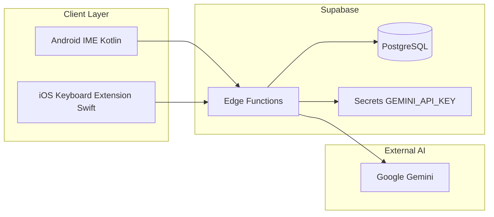
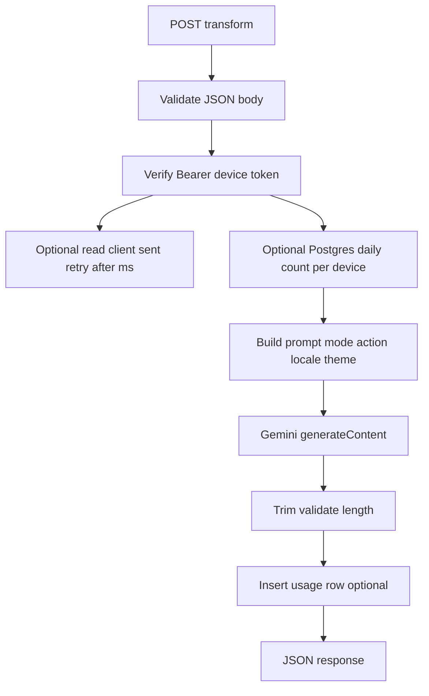

# Native AI Keyboard — System & Backend Architecture

## Overview

Native AI Keyboard has three layers: **Android keyboard** (Kotlin), **iOS keyboard** (Swift), and **Supabase-backed server logic** (PostgreSQL + **Edge Functions**). Mobile clients never hold the **Gemini API key**; they send `text`, `mode`, `action`, `locale`, optional `theme`, and a **device identifier** after registration.

**MVP backend scope:** HTTP handling and Gemini calls are implemented as **Supabase Edge Functions** (TypeScript on Deno). **Rate limiting** is **local debounce on the keyboard** plus optional **Postgres-backed** daily counters in Edge for visibility and soft caps. The versioned **`supabase/`** tree (migrations, functions, optional seed/schemas) lives next to app code — see [supabase_repo_layout.md](./supabase_repo_layout.md).

## Client layering (conceptual)

| Layer | Responsibility | Examples |
|-------|----------------|----------|
| **Configuration** | Base URLs, feature flags, build-time keys (never Gemini) | `Info.plist`, Gradle `BuildConfig` |
| **API** | Request/response types, HTTP calls, error mapping | `URLSession` / OkHttp for `register-device` and `transform` |
| **Service** | Orchestration: debounce, locale/mode selection, call API, map to UI | Transform use case before paste |
| **Repository / persistence** | Local prefs, secure token storage | `SharedPreferences`, App Group `UserDefaults`, Keychain |
| **Shared utilities** | Pure helpers | JSON, locale resolution, string limits |

This plan does not mandate a folder tree per layer; use it as a guideline when adding Kotlin/Swift modules.

## High-Level Diagram



## Mobile Architecture

### Android (Kotlin)

| Component | Technology | Description |
|-----------|------------|-------------|
| IME service | `InputMethodService` | System keyboard entry point |
| Layout | XML + custom `KeyboardView` | QWERTY + action bar |
| Networking | Retrofit / OkHttp | `POST` to Supabase Edge Function URLs |
| State | `SharedPreferences` | Last mode, theme, **local rate-limit counters** (UX / backoff) |
| Theme | Resource qualifiers + runtime | Light / dark |

### iOS (Swift)

| Component | Technology | Description |
|-----------|------------|-------------|
| Extension | `KeyboardViewController` | Keyboard UI |
| Layout | Auto Layout / UIStackView | Native spacing |
| Networking | `URLSession` | Edge Function HTTPS |
| State | App Group `UserDefaults` | Settings; **local rate-limit counters** |
| Permission | Full Access | Required for network requests |

## Backend Architecture (Supabase)

### Components

| Piece | Role |
|-------|------|
| **Edge Functions** | `register-device`, `transform` (and optional `health`, `settings` HTTP handlers). Validate body, read **Secrets** (`GEMINI_API_KEY`), call Gemini, return JSON. |
| **PostgreSQL** | `devices` (who uses the keyboard), optional `device_settings`, optional `usage_events` or daily counters for **analytics** and soft server-side caps. |
| **Supabase Secrets** | Gemini API key **only** here (Edge runtime env). Never stored in a client-readable table. |

### Versioned `supabase/` directory

Keep **migrations**, optional **seed** data, optional **schema** notes, and **Edge Functions** under the implementation repo’s `supabase/` folder (see [supabase_repo_layout.md](./supabase_repo_layout.md)). That layout matches common open-source Supabase apps and is easier for humans and tools to navigate than Markdown-only descriptions.

### Edge Function layout (under `supabase/functions/`)

```text
supabase/functions/
├── register-device/index.ts   # upsert device by deviceId + platform
├── transform/index.ts         # validate → optional DB quota → Gemini → JSON
└── _shared/
    └── prompts.ts             # mode × action × locale × theme templates
```

### Transform pipeline



1. Validate `text`, `mode`, `action`, `locale`, optional `theme`.
2. Authenticate **Bearer** token issued at device registration (secret signed or Supabase Auth pattern — MVP: opaque token stored with device row).
3. **Optional:** increment `usage_daily(device_id, date)` or append `usage_events`; reject with `429` if over soft cap (server truth for abuse).
4. Build system prompt from shared template map.
5. Call Gemini using **Secret** `GEMINI_API_KEY`.
6. Post-process; return `{ result, ... }`.

### Prompt templates

Same conceptual model as before; implemented as TypeScript module inside Edge Functions repo:

```typescript
// Conceptual structure
interface PromptTemplate {
  mode: 'work' | 'friends' | 'family' | 'flirt';
  action: 'correct' | 'rewrite' | 'shorten' | 'expand';
  locale: 'tr' | 'en';
  theme?: 'light' | 'dark' | 'system';
  systemPrompt: string;
}
```

### Gemini client (inside Edge Function)

- Model: `gemini-2.0-flash` (or current flash variant)
- Timeout: 15–30 seconds
- Retry: once on 5xx / timeout
- Key: **Supabase Secret** `GEMINI_API_KEY` (not `POSTGRES` URL in app code on device)

### Data stores

| Store | Usage |
|-------|--------|
| **PostgreSQL (Supabase)** | `devices` — register **deviceId** (client UUID or server-generated), `platform`, `created_at`, `device_token` (opaque bearer). Optional `device_settings`. Optional `usage_daily` / `usage_events` for “how many users / how many calls”. |
| **Separate cache tier** | **Out of scope for MVP** — server caps use Postgres only. |

### Sample tables (MVP)

**devices**

| Field | Type | Notes |
|-------|------|--------|
| id | UUID | Primary key |
| device_id | text | Unique; stable id from keyboard (generated once, stored in prefs / Keychain) |
| platform | text | `android` \| `ios` |
| device_token | text | Opaque bearer; returned once at register; stored hashed if desired |
| created_at | timestamptz | |

**usage_daily** (optional, for visibility + server cap)

| Field | Type |
|-------|------|
| device_id | UUID FK |
| day | date |
| transform_count | int |

### Rate limiting strategy

| Layer | Purpose |
|-------|---------|
| **Local (keyboard)** | Debounce taps, min interval between calls, simple counters in `SharedPreferences` / `UserDefaults` — improves UX and reduces accidental spam (**not security**). |
| **Edge Function + Postgres** | Optional hard/soft cap per `device_id` per day; returns `429 RATE_LIMIT_EXCEEDED`. Primary abuse control for production. |

## Security

- TLS 1.2+ (Supabase HTTPS endpoints).
- `Authorization: Bearer <device_token>` on `transform` (and `settings` if implemented server-side).
- Request body max size (e.g. 4 KB text) enforced in Edge Function.
- **Gemini API key:** only **Supabase Edge Function Secrets**; never in mobile binary, never in public RLS-readable columns.
- Log minimal fields; avoid raw full user text in logs where possible.

## Deployment

- **Supabase project** per environment (`staging`, `production`).
- Deploy Edge Functions via Supabase CLI / CI.
- Database migrations via Supabase SQL migrations.

## Observability

- Edge Function `console` / Supabase logs (request id, latency, mode, action).
- Post-MVP: Sentry on clients; OpenTelemetry if needed.
