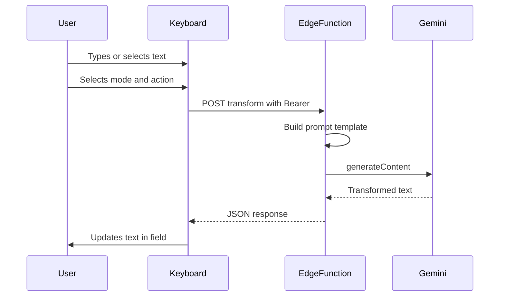
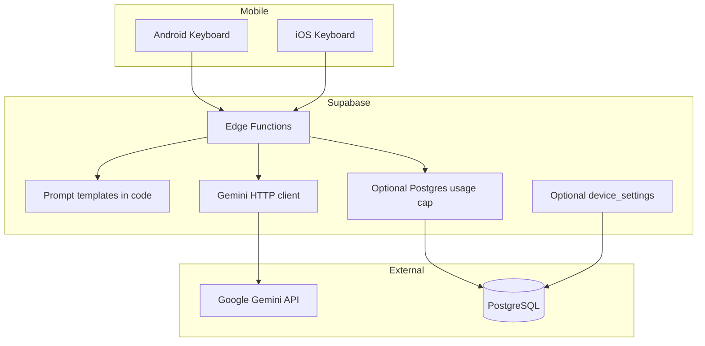

# Native AI Keyboard — Project Analysis

## Project Overview

**Native AI Keyboard** is an AI-powered custom keyboard extension for Android and iOS that feels close to the system keyboard experience. While composing messages or emails, users can fix typos, shorten, expand, or rewrite text using modes and actions on the keyboard—without copying text into an external AI app.

Text transformation is powered by the **Google Gemini API**; the **Gemini API key** exists only as a **Supabase Edge Function Secret** (never on device, never in client-readable DB columns).

## Problem Statement

When writing messages or emails in daily life and at work, people often face:

- Spelling mistakes and grammar issues
- Tone mismatches (too formal or too casual)
- Ambiguous phrasing and incomplete sentences

A common workaround is pasting text into an AI tool and repeating prompts such as:

- *"Fix spelling errors"*
- *"Write a longer version"*
- *"Make it shorter and clearer"*
- *"Rewrite in professional business language"*

This workflow is **slow**, **disruptive** (app switching), causes **loss of context**, and requires typing the same prompts over and over.

## Solution

Native AI Keyboard brings AI-assisted editing **where you type**:

| Feature | Description |
|--------|-------------|
| **4 core actions** | Correct · Rewrite · Shorten · Expand |
| **Keyboard modes** | Work · Friends · Family · Flirt (tone and prompt templates change) |
| **Color themes** | Light / dark and customizable palettes |
| **Native look & feel** | UI aligned with Android Material and iOS keyboard patterns |
| **Centralized AI** | Gemini via **Supabase Edge Functions**—secure and measurable |

## Goals

- Edit user text in one tap based on selected mode and action
- Remove the need to switch to external AI apps
- Deliver consistent UX on Android and iOS
- Centralize API keys and prompt logic in **Supabase Edge Functions** (server)
- Support Turkish and English text in the MVP

## Non-Goals (out of MVP scope)

- Full-screen chat app outside the keyboard
- User-defined free-form prompts (Phase 2)
- Offline / on-device models
- Windows or macOS system keyboards

## Target Audience

- Professionals who write emails and messages daily
- Users who want fast, accurate writing
- People already using AI with prompts who want that flow inside the keyboard

## Target Platforms & Languages

| Component | Platform | Language / Technology |
|-----------|----------|------------------------|
| Keyboard (Android) | Android 8+ (API 26+) | **Kotlin** — `InputMethodService` |
| Keyboard (iOS) | iOS 15+ | **Swift** — Keyboard Extension |
| Backend API | Supabase (Edge Functions + Postgres) | **TypeScript** on Deno edge; REST-style HTTPS |
| AI service | Google AI | **Gemini API** |
| Settings app | Phase 2 | Native companion or minimal settings Activity |

See also: [day_01/analysis.md](../day_01/analysis.md) · [architecture.md](./architecture.md) · [api_endpoints.md](./api_endpoints.md) · [ui_design.md](./ui_design.md) · [roadmap.md](./roadmap.md)

## UI Preview

Reference mockup (Day 01 — light theme, default keyboard):

*Work-mode variant mockup (`keyboard_work_mode.png`) is planned for a later design pass.*

## Technical Stack

- **Mobile (keyboard):** Platform-native (Kotlin + Swift)
- **Backend:** Supabase — **Edge Functions** (transform, register-device), **PostgreSQL** (devices, optional usage/settings)
- **Secrets:** Gemini key in **Supabase Secrets** only
- **Rate limit:** **Local** debounce on keyboard + optional **Postgres** daily counters in Edge Function
- **AI:** Google Gemini (`gemini-2.0-flash` or current flash model)

## System Architecture

## Backend Architecture (Summary)

| Module | Responsibility |
|--------|----------------|
| **register-device** | Persist `deviceId`, issue `deviceToken` |
| **transform** | Validate → optional usage check → prompt → Gemini → JSON |
| **Prompt templates** | Mode × action × locale × theme |
| **Secrets** | `GEMINI_API_KEY` only in Supabase |
| **Usage (optional)** | Per-device daily count in Postgres |
| **Settings (optional)** | Server-side prefs sync |

## AI Integration (Gemini)

- All requests go through **Supabase Edge Functions**; **no API keys on mobile clients**
- Each request: `systemPrompt(mode, action, locale)` + user text
- Validate empty or overly long responses before returning to the keyboard
- User-friendly errors on timeout or quota exceeded

### Mode × Action matrix (example tone)

| Mode | Correct | Rewrite | Shorten | Expand |
|------|---------|---------|---------|--------|
| **Work** | Formal, clear, fix spelling | Professional alternative phrasing | Concise business tone | Detailed, respectful |
| **Friends** | Casual fixes | Natural, everyday language | Short message style | Slightly more conversational |
| **Family** | Warm and clear | Soft phrasing | Brief update | More explanatory |
| **Flirt** | Engaging, not overdone | Warm alternate wording | Short flirt tone | Slightly longer, warm |

## UX / Main Flows

### Flow 1: Quick correction

1. User types in WhatsApp / Mail / Slack
2. Selects **Work** mode on the keyboard
3. Taps **Correct**
4. Edge Function returns edited text; keyboard inserts it into the field

### Flow 2: Tone change

1. User selects existing text
2. Chooses **Friends** → **Rewrite**
3. Result keeps meaning with a friendlier tone

### Flow 3: Theme

1. User changes theme from settings or keyboard
2. Light / dark palette applies immediately

## Keyboard Modes & Actions

### Modes

- `work` — Work
- `friends` — Friends
- `family` — Family
- `flirt` — Flirt

### Actions

- `correct` — Correct
- `rewrite` — Rewrite
- `shorten` — Shorten
- `expand` — Expand

## Security & Privacy

- HTTPS required
- Gemini API key only in **Supabase Edge Function Secrets**
- Text logs: short TTL or masking; not used for model training
- iOS **Full Access** requirement explained clearly to users
- Play Store / App Store privacy policy and keyboard permission copy

## Timeline

**Duration:** 14 days — **7 days Android + backend**, then **7 days iOS**, then shared ship/QA.

| Day | Topic |
|-----|--------|
| 01 | Repo, docs, Supabase project, Edge Function stub, health |
| 02 | Prompt templates in shared code + Gemini call from Edge Function (dev) |
| 03 | `transform` + `register-device`; Bearer tokens; optional Postgres usage cap |
| 04 | Android IME skeleton, QWERTY, locale |
| 05 | Android AI bar + API |
| 06 | Android modes + light/dark + long-press alternates |
| 07 | Android replace + preview accept/cancel + smoke QA |
| 08 | iOS Keyboard Extension skeleton |
| 09 | iOS layout (parity with Android) |
| 10 | iOS AI bar + API |
| 11 | iOS modes + themes + long-press alternates |
| 12 | iOS replace + preview accept/cancel |
| 13 | Settings persistence + cross-platform QA |
| 14 | Documentation, demo, delivery |

Details: [roadmap.md](./roadmap.md)

## Core Directives

1. **Native keyboard:** Keyboard UI is Kotlin (Android) and Swift (iOS); Flutter does not support keyboard extensions.
2. **Backend required:** All AI calls go through **Supabase Edge Functions** (server-side); keys in **Supabase Secrets**.
3. **Centralized prompts:** Mode and action templates live in Edge Function code (versioned with Git).
4. **Privacy first:** Minimum data collection, transparent permissions.
5. **MVP focus:** TR/EN locales and 4 modes first; expand in later phases.

## Risks & Mitigations

| Risk | Mitigation |
|------|------------|
| iOS keyboard constraints (Full Access) | Early testing; clear onboarding |
| API latency | Loading state, timeout, retry |
| Gemini cost | Flash model, max text length, **local debounce** + optional **Postgres** daily cap per `deviceId` |
| Poor AI output | Max length checks, empty response handling |
| Store rejection (privacy) | Data policy and minimal logging |

## Future Enhancements

- Custom user prompts
- Edit history
- Subscription and premium modes
- Certificate pinning
- Custom blended modes (e.g. work + flirt)

## Related Documents

- [README.md](../README.md) — Plan index: purpose, stack, MVP features, daily analysis links
- [architecture.md](./architecture.md) — System and backend architecture
- [api_endpoints.md](./api_endpoints.md) — REST API
- [ui_design.md](./ui_design.md) — UI mockup gallery
- [roadmap.md](./roadmap.md) — 14-day development plan
- [day_01/analysis.md](../day_01/analysis.md) … [day_14/analysis.md](../day_14/analysis.md) — per-day implementation notes
