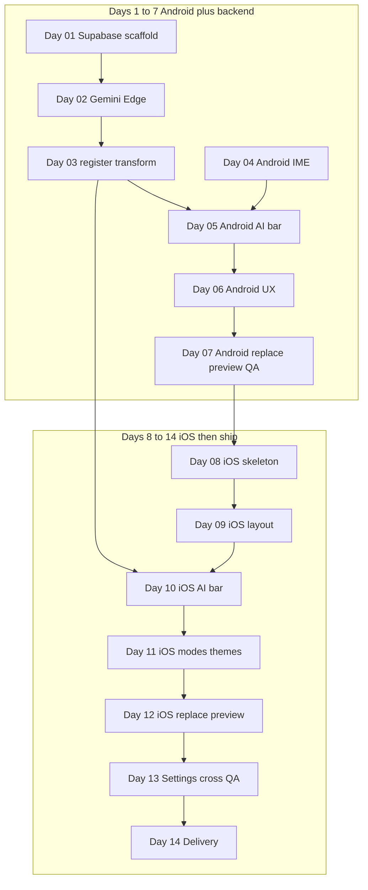

# Native AI Keyboard — 14 Day Roadmap

**Duration:** 14 days (sequential calendar)  
**Structure:** **Days 1–7 — Android track** (includes shared backend; Android MVP shippable by end of day 7). **Days 8–14 — iOS track** (reuses the same API; iOS MVP shippable by end of day 14).  
**Code root (future):** `trainee/projects/native_ai_keyboard/`

## Phase Overview

```mermaid
gantt
  title Native AI Keyboard MVP 7 plus 7
  dateFormat  YYYY-MM-DD
  section AndroidWeek
  D01 Supabase scaffold Edge stub :a1, 1d
  D02 Gemini prompts in Edge      :a2, 1d
  D03 register transform functions  :a3, 1d
  D04 Android IME skeleton      :a4, 1d
  D05 Android AI bar API        :a5, 1d
  D06 Android modes themes      :a6, 1d
  D07 Android replace QA        :a7, 1d
  section iOSWeek
  D08 iOS extension skeleton    :i1, 1d
  D09 iOS layout                :i2, 1d
  D10 iOS AI bar API            :i3, 1d
  D11 iOS modes themes          :i4, 1d
  D12 iOS replace preview       :i5, 1d
  D13 settings cross QA         :i6, 1d
  D14 delivery                  :i7, 1d
```

## Daily Breakdown

### Days 1–7 — Android + backend (shared API locked by day 3)

| Day | Track | Focus | Deliverable |
|-----|--------|--------|-------------|
| **01** | Backend + project | Repo, docs, **Supabase** init, `devices` table, Edge health stub | Linked project + deployable function shell |
| **02** | Backend | Gemini from Edge + **prompt templates** (TR/EN; theme hooks) in `_shared/` | Successful dev invoke to Gemini |
| **03** | Backend | **`register-device`** + **`transform`**; Bearer; optional **Postgres** daily usage cap | Android Day 05 can call HTTPS endpoints |
| **04** | Android | IME base | `InputMethodService`, QWERTY layout, TR/EN keyboard locale switch (host text locale) |
| **05** | Android | AI surface | Action bar wired to `/transform`, loading/error states |
| **06** | Android | UX | Mode strip, light/dark theme, long-press alternate keys (e.g. i → ı) baseline |
| **07** | Android | Polish | Selection/replace flow, **preview + accept/cancel** for AI result, Android smoke QA |

### Days 8–14 — iOS (same backend contract)

| Day | Track | Focus | Deliverable |
|-----|--------|--------|-------------|
| **08** | iOS | Extension base | Keyboard extension target, Full Access note, basic lifecycle |
| **09** | iOS | Layout | Key spacing, fonts, parity with Android zones (mode + actions + keys) |
| **10** | iOS | AI surface | Action bar + `/transform` integration, loading/error |
| **11** | iOS | UX | Modes, light/dark, long-press alternates parity |
| **12** | iOS | Polish | Replace flow, **preview + accept/cancel** parity with Android |
| **13** | Cross | Settings + QA | Default mode/theme persistence (both), empty/long text, offline, timeout |
| **14** | Cross | Ship | README, demo, doc freeze, regression on Android + iOS |

## Dependencies



**Rule:** No iOS network integration (day 10+) until **day 03** API is stable; Android days 4–7 validate the contract for iOS.

## Related

- [overview.md](./overview.md) — Full project analysis
- [architecture.md](./architecture.md) — Technical architecture
- [api_endpoints.md](./api_endpoints.md) — API contract
- [ui_design.md](./ui_design.md) — UI mockups
