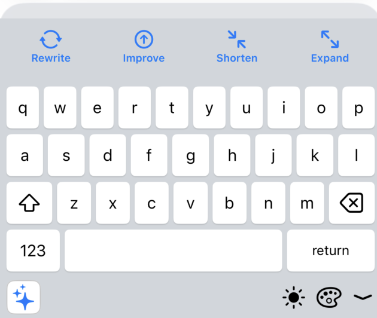

# Native AI Keyboard — UI Design & Mockups

## Repository naming (mockups and assets)

Add new images under `assets/mockups/` using **English** file names (e.g. `keyboard_work_mode.png`). Keep user-visible UI copy localized in app resources; repository paths stay language-neutral for contributors.

## Design Goals

- **Native feel:** Users should not feel a sharp break from the system keyboard
- **Fast access:** AI actions reachable in at most 1–2 taps
- **Minimal distraction:** Compact action bar; QWERTY area remains primary
- **Visible mode state:** Selected mode (Work, Friends, etc.) distinguished by color or icon

## Screen Inventory

| # | Screen | Mockup file | Status |
|---|--------|-------------|--------|
| 1 | Default keyboard (light theme) | `keyboard_default_light.png` | Complete |
| 2 | Keyboard with mode emphasis (e.g. Work selected) | `keyboard_work_mode.png` | Deferred |

## Mockup Gallery

### 1. Default keyboard



*Figure 1: QWERTY layout with mode strip and AI action bar (Correct · Rewrite · Shorten · Expand).*

### 2. Work mode / alternate view (deferred)

*Planned mockup: `keyboard_work_mode.png` — same layout as Figure 1 with Work mode selected (accent color). To be added in a later design pass.*

> **Mockups folder:**  
> `native_ai_keyboard_plan/assets/mockups/` (repo: `trainee/projects/docs/projects/native_ai_keyboard_plan/assets/mockups/`)

## UI Component Map

| UI element (mockup) | Android | iOS |
|---------------------|---------|-----|
| QWERTY key layout | `Keyboard` XML / custom view | `UIStackView` + key buttons |
| Mode selector | Horizontal `ChipGroup` / RecyclerView | `UISegmentedControl` or chip row |
| Action bar | 4 `Button` / `MaterialButton` | 4 `UIButton` |
| Theme | `values-night` + SharedPreferences | Trait collection + UserDefaults |
| Loading | Progress overlay on action bar | `UIActivityIndicator` |

## Layout Zones

```
┌─────────────────────────────────────┐
│  Mode: [Work][Friends][Family][Flirt]│  ← Mode strip
├─────────────────────────────────────┤
│ [Correct][Rewrite][Shorten][Expand] │  ← Action bar
├─────────────────────────────────────┤
│           Q W E R T Y ...           │  ← Key area
│           A S D F G ...             │
│           Z X C V B ...             │
└─────────────────────────────────────┘
```

## Open Design Questions

- Mode selector: horizontal scroll vs dropdown?
- After action: auto-replace text vs preview + confirm?
- On iOS: action bar above keys vs separate row?
